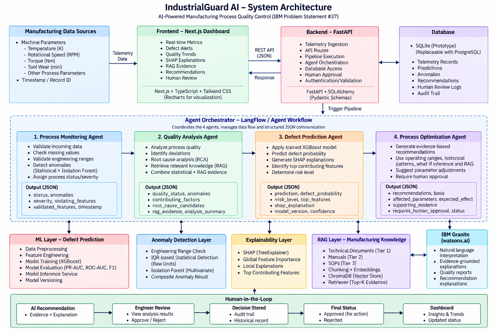
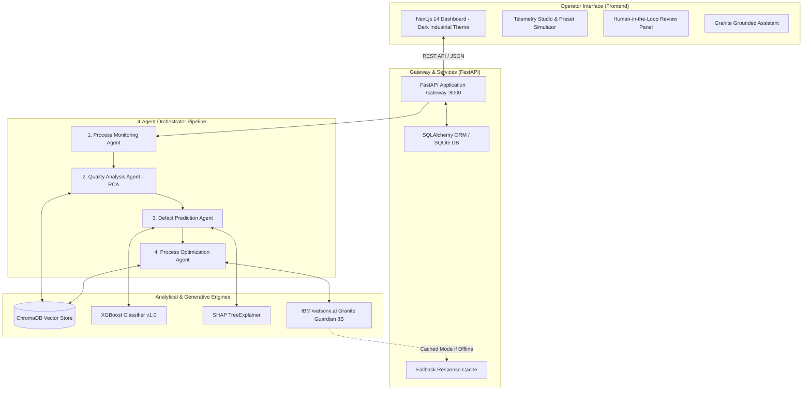

# IndustrialGuard AI 🛡️

**Agentic AI-Powered Manufacturing Quality Control & Defect Prevention System**  
*IBM Problem Statement #37 — Industrial Decision-Support Architecture*

---

[](https://www.python.org/)
[](https://fastapi.tiangolo.com/)
[](https://nextjs.org/)
[](https://xgboost.readthedocs.io/)
[](https://www.trychroma.com/)
[](https://www.ibm.com/products/watsonx-ai)
[]()
[](https://creativecommons.org/licenses/by/4.0/)

---

## ⚠️ Important Disclaimer

> [!IMPORTANT]
> **IndustrialGuard AI is an industrial decision-support prototype** engineered for CNC quality monitoring and preventive defect prediction.
> - **Not an Autonomous Controller:** It does **not** directly actuate physical machine controls or bypass certified PLC/SCADA safety interlocks.
> - **Human-in-the-Loop:** All prescriptive corrective actions require human engineer verification and authorization before shop-floor execution.
> - **Strict Evidentiary Grounding:** The generative LLM layer (IBM Granite Guardian 8B) performs natural-language synthesis and evidence narration only; numerical predictions and statistical thresholds are strictly derived from deterministic machine learning models and empirical operating envelopes.

---

## 📑 Table of Contents

- [System Overview](#system-overview)
- [System Architecture](#system-architecture)
- [The 4-Agent Pipeline](#the-4-agent-pipeline)
- [Modern Operator Interface (Next.js 14 Dashboard)](#modern-operator-interface-nextjs-14-dashboard)
- [Machine Learning & Anomaly Detection](#machine-learning--anomaly-detection)
- [Explainability & Root-Cause Analysis (XAI)](#explainability--root-cause-analysis-xai)
- [Retrieval-Augmented Generation (RAG)](#retrieval-augmented-generation-rag)
- [Single-Entry Runner (`app.py`)](#single-entry-runner-apppy)
- [REST API Reference](#rest-api-reference)
- [Project Structure](#project-structure)
- [Installation & Quickstart](#installation--quickstart)
- [Running the Test Suite](#running-the-test-suite)
- [Decision Log Summary](#decision-log-summary)
- [Project Resources & Deliverables](#project-resources--deliverables)
- [License & Attributions](#license--attributions)

---

## System Overview

Manufacturing operations generate continuous multi-sensor telemetry (thermal, vibrational, torque, rotational). IndustrialGuard AI bridges deterministic industrial engineering analytics with generative AI reasoning.

Rather than relying on ungrounded conversational models, IndustrialGuard AI executes an evidential pipeline:

```
TELEMETRY DATA (Air Temp, Process Temp, Speed, Torque, Wear)
      │
      ▼
[Stage 1: Process Monitoring Agent] ────> Physical Range & Completeness Validation
      │
      ▼
[Stage 2: Quality Analysis Agent]   ────> Dual Anomaly Detection (IQR + Isolation Forest) & SHAP RCA
      │
      ▼
[Stage 3: Defect Prediction Agent]  ────> Supervised XGBoost Classifier (Probability & Risk)
      │
      ▼
[Stage 4: Optimization Agent]       ────> Prescriptive What-If Guidance & RAG Manual Citations
      │
      ▼
[Human Engineer Review Gate]        ────> Mandatory Sign-off (Approve / Reject) in Database Audit Log
```

---

## System Architecture





---

## The 4-Agent Pipeline

IndustrialGuard AI strictly implements the four specialized agents designated in IBM Problem Statement #37:

| Agent | Core Responsibility | Input | Output Artifact |
|---|---|---|---|
| **1. Process Monitoring Agent** | Telemetry sanity verification, physical bounds validation, and real-time streaming status check. | Raw parameter payload (`{temp, speed, torque...}`) | `ProcessMonitoringOutput` (Status: `NORMAL`, `CAUTION`, `CRITICAL`) |
| **2. Quality Analysis Agent** | Multi-variate anomaly detection, statistical deviation scoring, and Root-Cause Analysis (RCA). | Monitoring output + anomaly telemetry | `QualityAnalysisOutput` (Contributing factors & evidence tags) |
| **3. Defect Prediction Agent** | High-precision defect classification, prediction confidence estimation, and local SHAP feature breakdown. | Quality analysis report + feature vector | `DefectPredictionOutput` (Class, probability, risk level) |
| **4. Process Optimization Agent** | Prescriptive parameter adjustments via what-if inference, historical comparison, and validated operating envelopes. | Prediction output + technical context | `RecommendationOutput` (Awaiting Human Review) |

---

## Modern Operator Interface (Next.js 14 Dashboard)

The frontend is built with **Next.js 14, TypeScript, Tailwind CSS, Recharts, and Lucide React** in a dark industrial cyber aesthetic (`#0a0d14` background, subtle glassmorphism, glowing telemetry cards, and status radar pulses):

1. **Top Navigation Bar (`Navbar.tsx`):**
   - Real-time backend connectivity ping (`ONLINE (8000)` with live radar pulse).
   - Dynamic alert counter pills for pending human sign-offs and detected anomalies.
   - Smooth instant switching across all 7 operational tabs.

2. **Telemetry Studio & Simulation (`TelemetryStudio.tsx`):**
   - **Interactive Parameter Sliders:** Real-time adjustments for Air Temperature, Process Temperature, Rotational Speed, Torque, and Tool Wear with visual empirical bounds warnings.
   - **Quick-Load Failure Mode Presets:**
     - 🟢 *Normal CNC Operation* (300.1K, 310.0K, 1525 RPM, 39.2 Nm, 110 min)
     - 🟠 *High Tool Wear & Elevated Torque* (304.8K, 315.2K, 1180 RPM, 68.5 Nm, 235 min)
     - 🔴 *Critical Heat Dissipation / Power Strain* (307.5K, 317.0K, 1100 RPM, 75.0 Nm, 255 min)
     - 🟡 *Rapid Overstrain Risk* (301.8K, 311.5K, 1350 RPM, 63.0 Nm, 215 min)
   - **Full Evidential Pipeline Results:** Displays Stage 1 Anomaly report, Stage 2 SHAP feature attribution bars, Stage 3 Defect Probability bar, and Stage 4 Prescriptive guidance.

3. **4-Agent Pipeline Stage Flow (`PipelineStageFlow.tsx`):**
   - Visual architectural cards tracking the exact role and execution status of each of the 4 autonomous agents.

4. **Human-in-the-Loop Review Queue (`RecommendationsTab.tsx`):**
   - Search and filter by `PENDING`, `APPROVED`, `REJECTED`.
   - Interactive **Approve** and **Reject** buttons with modal requesting Engineer ID and optional corrective action, updating the database audit log via `POST /api/recommendations/{id}/review`.

5. **Defect Predictions Log (`PredictionsTab.tsx`):**
   - Searchable and filterable history of model classifications with probability progress bars and risk badges.

6. **Dual Anomaly Monitor (`AnomaliesTab.tsx`):**
   - Complete log of statistical violations with deviation in IQR units and Isolation Forest multi-variate scores.

7. **Model Governance & Limits (`ModelGovernanceTab.tsx`):**
   - Evaluation metrics: **PR-AUC (0.8300)**, **ROC-AUC (0.9780)**, **F1 (0.8120)**, **Accuracy (98.2%)**.
   - Safe empirical operating ranges table derived from the 10,000 production records.

8. **IBM Granite Grounded Assistant (`ChatAssistantTab.tsx`):**
   - Grounded conversational AI interface with avatar chat bubbles.
   - One-click prompt suggestions and RAG knowledge base provenance citations.

9. **Standalone Dashboard (`index.html`):**
   - Lightweight standalone HTML/CSS/JS dashboard that runs directly in any browser without Node.js dependencies.

---

## Machine Learning & Anomaly Detection

### Experiment 1: Model Selection Benchmark (AI4I 2020 Manufacturing Dataset)

Models were evaluated on an isolated validation set using **Precision-Recall AUC (PR-AUC)** as the primary selection criterion to protect against extreme class imbalance (3.39% defect rate):

| Candidate Model | Train F1 | Train PR-AUC | Val F1 | Val PR-AUC | Val ROC-AUC | Status |
|---|---|---|---|---|---|---|
| Logistic Regression | 0.5005 | 0.5583 | 0.4767 | 0.5454 | 0.7291 | Baseline |
| Random Forest | 0.9969 | 1.0000 | 0.7200 | 0.7946 | 0.9276 | Candidate |
| **XGBoost (Selected)** | **1.0000** | **1.0000** | **0.6977** | **0.8300** | **0.9405** | **Winner** |

**Final Evaluation on Unseen Test Partition:**
- **Test Precision-Recall AUC:** `0.9198`
- **Test ROC-AUC:** `0.9755`
- **Test F1 Score:** `0.8217`
- **Test Overall Accuracy:** `98.2%`

### Anomaly Detection Architecture
- **Isolation Forest:** Multi-variate tree isolation identifying non-linear parameter anomalies across the 5-dimensional feature space.
- **Statistical IQR Limits:** Empirical bounds computed on normal-class baseline data ($Q_1 - 2.5 \times \text{IQR}$, $Q_3 + 2.5 \times \text{IQR}$) providing immediate physical interpretability in true engineering units.

---

## Explainability & Root-Cause Analysis (XAI)

Every defect prediction is paired with mathematical attribution calculated via **SHAP (SHapley Additive exPlanations)**:
- **Global Importance:** Ranks top system-wide failure drivers across the manufacturing envelope (`tool_wear`, `torque`, `rotational_speed`).
- **Local Attribution:** Computes exact directional shifts per incoming batch, explaining why a specific record crossed the risk threshold.
- **RCA Synthesis:** The Quality Analysis Agent cross-references high-SHAP features with detected IQR violations and retrieves matching engineering documentation.

---

## Retrieval-Augmented Generation (RAG)

Technical knowledge is structured in a 3-tier provenance hierarchy stored in ChromaDB using local MiniLM embeddings:

1. **Tier 1 (International Technical Standards):**  
   - `iso_13374_condition_monitoring.md`: Information architecture for machine condition monitoring, diagnostics, and human supervisory mandates.
2. **Tier 2 (Industrial Technical Manuals):**  
   - `tool_wear_thermal_compensation_guide.md`: Cutting tool flank wear dynamics, convective chip evacuation, and thermal dissipation balance.
3. **Tier 3 (Demonstration Knowledge):**  
   - `demo_operating_procedures.md`: Explicitly labeled project-generated operating envelopes and CNC incident protocols.

---

## Single-Entry Runner (`app.py`)

The project features a unified CLI entrypoint:

```bash
python app.py              # Starts FastAPI backend on http://127.0.0.1:8000
python app.py --demo       # Runs the 3-scenario CLI demo walkthrough
python app.py --pipeline   # Executes the full ML pipeline end-to-end
python app.py --rag        # Ingests documents and rebuilds ChromaDB vector store
python app.py --test       # Runs the 41-case pytest integration suite
```

---

## REST API Reference

The FastAPI backend exposes typed REST endpoints:

| Method | Endpoint | Description |
|---|---|---|
| `GET` | `/health` | Service health check and UTC timestamp |
| `POST` | `/api/data` | Ingest raw process telemetry record |
| `POST` | `/api/analyze` | Execute complete 4-agent pipeline on a telemetry record |
| `GET` | `/api/process-status` | Retrieve latest process status history |
| `GET` | `/api/anomalies` | Retrieve recent detected anomalies and severity |
| `GET` | `/api/predictions` | Retrieve recent ML defect predictions and probabilities |
| `GET` | `/api/recommendations` | List optimization recommendations filtered by review status |
| `POST` | `/api/recommendations/{id}/review` | Record human engineer approval/rejection and action taken |
| `GET` | `/api/metrics` | Quality overview metrics (defect rate, anomaly counts) |
| `GET` | `/api/model-performance` | Registered model version metadata and validation metrics |
| `POST` | `/api/chat` | Grounded AI assistant interface (IBM Granite + RAG) |

Interactive Swagger documentation is available at `http://localhost:8000/docs`.

---

## Project Structure

```
IndustrialGuard-AI/
├── .env.example             # Configuration template with CORS & IBM watsonx settings
├── .gitignore               # Clean git exclusions (DB, venv, caches, node_modules)
├── app.py                   # Single-entry CLI runner & server launcher
├── index.html               # Standalone lightweight operator dashboard
├── style.css                # Standalone styling for index.html
├── pyproject.toml           # Python packaging and dependency specifications
├── requirements.txt         # Production Python dependencies
├── README.md                # Architectural documentation & quickstart
├── DATASET.md               # AI4I 2020 dataset card and feature specifications
├── DECISION_LOG.md          # Architectural and experimental decision log
├── DEMO_CONTRACT.md         # End-to-end demo execution contract
│
├── backend/                 # FastAPI application
│   ├── main.py              # Application gateway, CORS, and API routes
│   ├── db/
│   │   └── models.py        # SQLAlchemy ORM models (SQLite/PostgreSQL)
│   └── services/
│       └── granite_client.py# IBM watsonx.ai client with fallback resilience
│
├── agents/                  # The 4-agent pipeline
│   ├── monitoring/          # Stage 1: Process Monitoring Agent
│   ├── quality_analysis/    # Stage 2: Quality Analysis & RCA Agent
│   ├── defect_prediction/   # Stage 3: Defect Prediction Agent
│   ├── optimization/        # Stage 4: Process Optimization Agent
│   └── orchestrator/        # Pipeline coordinator and demo runner
│
├── ml/                      # Machine Learning workflows
│   ├── preprocessing/       # Cleaning, outlier capping, stratified splitting
│   ├── models/              # Model training, comparison, and inference
│   ├── anomaly/             # Isolation Forest and IQR thresholding
│   ├── explainability/      # SHAP feature importance and local attribution
│   └── evaluation/          # Serialized metrics and operating ranges
│
├── rag/                     # Retrieval-Augmented Generation
│   ├── ingestion/           # Document loader, chunker, and tier tagger
│   ├── vectorstore/         # ChromaDB local persistent vector store
│   ├── retrieval/           # Context retriever with source attribution
│   └── knowledge_base/      # Tier 1, 2, and 3 technical domain documents
│
├── frontend/                # Next.js 14 Operator Dashboard
│   ├── src/
│   │   ├── components/      # Modular UI components:
│   │   │   ├── Navbar.tsx             # Header with live radar indicator
│   │   │   ├── OverviewTab.tsx        # KPI cards & probability trend chart
│   │   │   ├── TelemetryStudio.tsx    # Interactive parameter sliders & presets
│   │   │   ├── PipelineStageFlow.tsx  # 4-stage pipeline visualizer
│   │   │   ├── PredictionsTab.tsx     # Defect classifications log
│   │   │   ├── AnomaliesTab.tsx       # Dual anomaly monitor
│   │   │   ├── RecommendationsTab.tsx # Human-in-the-loop review queue
│   │   │   ├── ModelGovernanceTab.tsx # Evaluation metrics & envelopes
│   │   │   ├── ChatAssistantTab.tsx   # Grounded Granite assistant
│   │   │   ├── MetricCard.tsx         # Sleek glassmorphism metric cards
│   │   │   └── RiskBadge.tsx          # Status badges with glowing dots
│   │   ├── pages/
│   │   │   ├── index.tsx              # Main dashboard view
│   │   │   └── _app.tsx               # App entry
│   │   ├── styles/
│   │   │   └── globals.css            # Dark industrial theme & radar animations
│   │   └── lib/
│   │       └── api.ts                 # Fully typed REST API client
│   ├── package.json         # Node.js dependencies (Next.js 14, Recharts, Lucide)
│   ├── tailwind.config.js   # Tailwind CSS configuration
│   └── tsconfig.json        # TypeScript configuration
│
├── langflow/                # Agentic visual workflow export
│   └── industrialguard_workflow.json
│
├── Resources/               # Presentations & architectural diagrams
│   ├── Architecture.png
│   ├── IndustrialGuard_AI_Presentation.pptx
│   └── Completion Certificate _ SkillsBuild.pdf
│
├── scripts/                 # Utility automation scripts
│   ├── create_dataset.py    # AI4I dataset generator
│   ├── generate_operating_ranges.py # Operating range calculator
│   └── setup_project.py     # Environment initialization verification
│
└── tests/                   # 41-case Test Suite (Unit, Integration, E2E)
    ├── integration/         # API endpoint integration tests
    ├── ml/                  # Model inference and explainability tests
    ├── rag/                 # Vector retrieval and chunking tests
    └── unit/                # Anomaly detection, preprocessing, and agent tests
```

---

## Installation & Quickstart

### Prerequisites
- **Python:** 3.11 or higher
- **Node.js:** v18.0 or higher
- **Git**

### 1. Clone & Set Up Environment

```bash
git clone https://github.com/Omganesh014/IndustrialGuard-AI.git
cd IndustrialGuard-AI

# Create virtual environment
python -m venv .venv

# Activate virtual environment
# Windows:
.venv\Scripts\activate
# Linux/macOS:
source .venv/bin/activate

# Install Python dependencies
pip install -r requirements.txt
```

### 2. Configure Environment

Copy `.env.example` to `.env`:

```bash
cp .env.example .env
```

*(Optional)* Configure IBM watsonx.ai credentials in `.env` if you have an active IBM Cloud account:

```env
WATSONX_API_URL=https://us-south.ml.cloud.ibm.com
WATSONX_API_KEY=your_ibm_api_key_here
WATSONX_PROJECT_ID=your_project_id_here
GRANITE_MODEL_ID=ibm/granite-guardian-8b
USE_CACHED_GRANITE_RESPONSES=true
```

### 3. Start the Backend API

```bash
python app.py
```
- API Base: `http://localhost:8000`
- Swagger Docs: `http://localhost:8000/docs`
- Health Check: `http://localhost:8000/health`

### 4. Start the Operator Dashboard

In a new terminal:

```bash
cd frontend
npm install
npm run dev
```

Open **`http://localhost:3000`** in your browser.

*(Alternative)* You can also simply double-click or open **`index.html`** in your browser for the lightweight standalone dashboard!

---

## Running the Test Suite

The test suite covers API endpoints, multi-agent workflows, model inference, anomaly detection, data preprocessing, and vector retrieval:

```bash
python app.py --test
# or
pytest -v
```

```
tests/integration/test_api.py ............                               [ 29%]
tests/ml/test_models.py ....                                             [ 39%]
tests/rag/test_rag.py .....                                              [ 51%]
tests/unit/test_agents.py ......                                         [ 65%]
tests/unit/test_anomaly_detector.py .......                              [ 82%]
tests/unit/test_preprocessing.py .......                                 [100%]

======================= 41 passed, 2 warnings in 13.77s =======================
```

---

## Decision Log Summary

For full technical justifications and gate records, refer to [`DECISION_LOG.md`](DECISION_LOG.md):
- **DECISION-001:** IBM watsonx.ai Granite LLM with deterministic caching for demo resilience.
- **DECISION-002:** AI4I 2020 Predictive Maintenance Dataset selected across 8 weighted criteria.
- **DECISION-003:** 3-tier hierarchical knowledge base design preserving provenance.
- **DECISION-004:** In-process SQLite for clean local execution, upgradeable via SQLAlchemy.
- **DECISION-005:** Local embedded ChromaDB avoiding cloud database latency.
- **DECISION-006:** RCA encapsulated within Quality Analysis Agent to satisfy the 4-agent constraint.
- **DECISION-007:** XGBoost selected over Random Forest and Logistic Regression based on validation PR-AUC (0.8300).
- **DECISION-008:** Dual anomaly detection combining Isolation Forest and unscaled IQR bounds.
- **DECISION-009:** SHAP TreeExplainer for feature importance and local record attribution.
- **DECISION-010:** Tri-partite evidential basis for optimization recommendations.

---

## Project Resources & Deliverables

- 📊 **Presentation Deck:** [`Resources/IndustrialGuard_AI_Presentation.pptx`](Resources/IndustrialGuard_AI_Presentation.pptx)
- 🖼️ **System Architecture Diagram:** [`Resources/Architecture.png`](Resources/Architecture.png)
- ⚙️ **Langflow Agentic Workflow Export:** [`langflow/industrialguard_workflow.json`](langflow/industrialguard_workflow.json)
- 📜 **IBM SkillsBuild Certification:** [`Resources/Completion Certificate _ SkillsBuild.pdf`](Resources/Completion%20Certificate%20_%20SkillsBuild.pdf)

---

## License & Attributions

- **Codebase:** Distributed under the MIT License.
- **Dataset:** AI4I 2020 Predictive Maintenance Dataset licensed under [Creative Commons Attribution 4.0 International (CC BY 4.0)](https://creativecommons.org/licenses/by/4.0/).
- **IBM watsonx.ai & Granite:** Trademarks and technologies of International Business Machines Corp.
