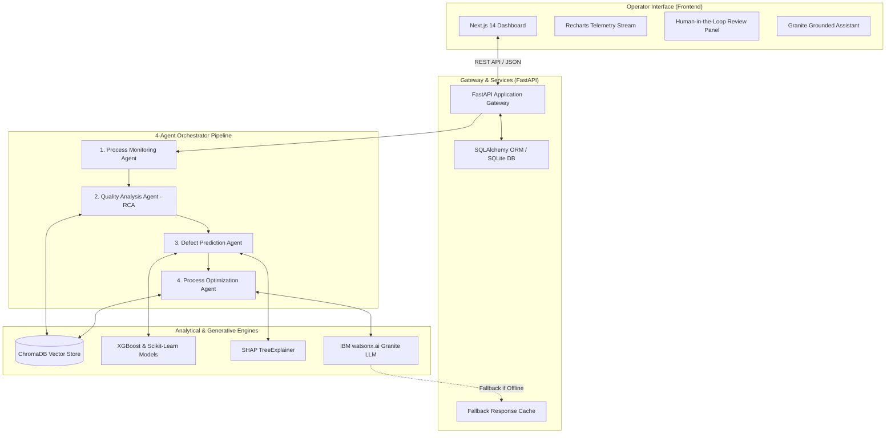

# IndustrialGuard AI 🛡️

**Agentic AI-Powered Manufacturing Quality Control & Defect Prevention System**  
*IBM Problem Statement #37 — Industrial Decision-Support Architecture*

---

[](https://www.python.org/)
[](https://fastapi.tiangolo.com/)
[](https://nextjs.org/)
[](https://xgboost.readthedocs.io/)
[](https://www.trychroma.com/)
[](https://www.ibm.com/products/watsonx-ai)
[]()
[](https://creativecommons.org/licenses/by/4.0/)

---

## ⚠️ Important Disclaimer

> [!IMPORTANT]
> **IndustrialGuard AI is a decision-support prototype** engineered for industrial quality monitoring and preventive analysis.
> - **Not an Autonomous Controller:** It does **not** directly actuate physical machine controls or bypass certified PLC/SCADA safety interlocks.
> - **Human-in-the-Loop:** All prescriptive corrective actions require human engineer verification and authorization before shop-floor execution.
> - **Strict Grounding:** The generative LLM layer (IBM Granite) performs natural-language synthesis and evidence narration only; numerical predictions and thresholds are strictly derived from deterministic machine learning models and empirical operating envelopes.

---

## 📑 Table of Contents

- [System Overview](#system-overview)
- [Core Architecture](#core-architecture)
- [The 4-Agent Pipeline](#the-4-agent-pipeline)
- [Machine Learning & Anomaly Detection](#machine-learning--anomaly-detection)
- [Explainability & Root-Cause Analysis (XAI)](#explainability--root-cause-analysis-xai)
- [Retrieval-Augmented Generation (RAG)](#retrieval-augmented-generation-rag)
- [Demo Incident Walkthrough](#demo-incident-walkthrough)
- [REST API Reference](#rest-api-reference)
- [Project Structure](#project-structure)
- [Installation & Quickstart](#installation--quickstart)
- [Running the Test Suite](#running-the-test-suite)
- [Decision Log Summary](#decision-log-summary)
- [License & Attributions](#license--attributions)

---

## System Overview

Manufacturing operations generate continuous multi-sensor telemetry (thermal, vibrational, torque, rotational). IndustrialGuard AI bridges deterministic industrial engineering analytics with generative AI reasoning.

Rather than relying on ungrounded conversational models, IndustrialGuard AI executes an evidentiary pipeline:

```
TELEMETRY DATA
      │
      ▼
[Stage 1: Process Monitoring] ──────> Physical Range & Completeness Validation
      │
      ▼
[Stage 2: Quality Analysis]   ──────> Dual Anomaly Detection (IQR + Isolation Forest)
      │
      ▼
[Stage 3: Defect Prediction]  ──────> Supervised ML Classification & SHAP Attribution
      │
      ▼
[Stage 4: Process Optimization] ────> Rule-Based & What-If Prescriptive Analysis
      │
      ▼
[Human Engineer Review]       ──────> Authorization & Audit Logging in Database
```

---

## Core Architecture



---

## The 4-Agent Pipeline

IndustrialGuard AI strictly implements the four specialized agents designated in IBM Problem Statement #37:

| Agent | Core Responsibility | Input | Output Artifact |
|---|---|---|---|
| **1. Process Monitoring Agent** | Telemetry sanity verification, physical bounds validation, and real-time streaming status check. | Raw parameter payload (`{temp, speed, torque...}`) | `ProcessMonitoringOutput` (Status: `NORMAL`, `CAUTION`, `CRITICAL`) |
| **2. Quality Analysis Agent** | Multi-variate anomaly detection, statistical deviation scoring, and Root-Cause Analysis (RCA). | Monitoring output + anomaly telemetry | `QualityAnalysisOutput` (Contributing factors & evidence tags) |
| **3. Defect Prediction Agent** | High-precision defect classification, prediction confidence estimation, and local SHAP feature breakdown. | Quality analysis report + feature vector | `DefectPredictionOutput` (Class, probability, risk level) |
| **4. Process Optimization Agent** | Prescriptive parameter adjustments via what-if inference, historical comparison, and validated operating envelopes. | Prediction output + technical context | `RecommendationOutput` (Awaiting Human Review) |

---

## Machine Learning & Anomaly Detection

### Experiment 1: Model Selection Benchmark (AI4I 2020 Manufacturing Dataset)

Models were evaluated on an isolated validation set using **Precision-Recall AUC (PR-AUC)** as the primary selection criterion to protect against class imbalance:

| Candidate Model | Train F1 | Train PR-AUC | Val F1 | Val PR-AUC | Val ROC-AUC | Status |
|---|---|---|---|---|---|---|
| Logistic Regression | 0.5005 | 0.5583 | 0.4767 | 0.5454 | 0.7291 | Baseline |
| Random Forest | 0.9969 | 1.0000 | 0.7200 | 0.7946 | 0.9276 | Candidate |
| **XGBoost (Selected)** | **1.0000** | **1.0000** | **0.6977** | **0.8300** | **0.9405** | **Winner** |

**Final Evaluation on Unseen Test Partition:**
- **Test Precision-Recall AUC:** `0.9198`
- **Test ROC-AUC:** `0.9755`
- **Test F1 Score:** `0.8217`

### Anomaly Detection Architecture
- **Isolation Forest:** Multi-variate tree isolation identifying global non-linear parameter anomalies across the 5-dimensional feature space.
- **Statistical IQR Limits:** Empirical bounds computed on normal-class baseline data ($Q_1 - 2.5 \times \text{IQR}$, $Q_3 + 2.5 \times \text{IQR}$) providing immediate physical interpretability in true engineering units.

---

## Explainability & Root-Cause Analysis (XAI)

Every defect prediction is paired with mathematical attribution calculated via **SHAP (SHapley Additive exPlanations)**:
- **Global Importance:** Ranks top system-wide failure drivers across the manufacturing envelope (`tool_wear`, `torque`, `rotational_speed`).
- **Local Attribution:** Computes exact directional shifts per incoming batch, explaining why a specific record crossed the risk threshold.
- **RCA Synthesis:** The Quality Analysis Agent cross-references high-SHAP features with detected IQR violations and retrieves matching engineering documentation.

---

## Retrieval-Augmented Generation (RAG)

Technical knowledge is structured in a 3-tier provenance hierarchy stored in ChromaDB using local MiniLM embeddings:

1. **Tier 1 (International Technical Standards):**  
   - `iso_13374_condition_monitoring.md`: Information architecture for machine condition monitoring, diagnostics, and human supervisory mandates.
2. **Tier 2 (Industrial Technical Manuals):**  
   - `tool_wear_thermal_compensation_guide.md`: Cutting tool flank wear dynamics, convective chip evacuation, and thermal dissipation balance.
3. **Tier 3 (Demonstration Knowledge):**  
   - `demo_operating_procedures.md`: Explicitly labeled project-generated operating envelopes and CNC incident protocols.

---

## Demo Incident Walkthrough

Run the standard end-to-end incident scenario ("Batch 2024-001 Incident"):

```bash
python -c "from agents.orchestrator.pipeline import run_demo_scenario; import json; print(json.dumps(run_demo_scenario(), indent=2))"
```

**Scenario Details:**
- **Input Parameters:** `air_temperature: 301.2 K`, `process_temperature: 311.8 K`, `rotational_speed: 1395.0 rpm`, `torque: 64.5 Nm`, `tool_wear: 218.0 min`.
- **Stage 1 (Monitoring):** Physical range validation passes.
- **Stage 2 (Quality Analysis):** Severe statistical violation detected (`tool_wear` exceeds normal limit > 200 min; `torque` exceeds upper limit). Anomaly severity: `HIGH`.
- **Stage 3 (Defect Prediction):** XGBoost outputs `DEFECTIVE` with **99.3% probability**. Risk level escalated to `HIGH`.
- **Stage 4 (Optimization):**
  - What-if inference calculates that decreasing `tool_wear` reduces defect probability from **99.3% to 51.3%** ($\Delta = 0.4804$).
  - Rule-based analysis recommends adjusting `torque` toward the normal operating range ([25.97, 52.89] Nm).
  - IBM Granite produces a grounded narrative with explicit human-in-the-loop review warnings.

---

## REST API Reference

The FastAPI backend exposes typed endpoints:

| Method | Endpoint | Description |
|---|---|---|
| `GET` | `/health` | Service health check and UTC timestamp |
| `POST` | `/api/data` | Ingest raw process telemetry record |
| `POST` | `/api/analyze` | Execute complete 4-agent pipeline on a telemetry record |
| `GET` | `/api/process-status` | Retrieve latest process status history |
| `GET` | `/api/anomalies` | Retrieve recent detected anomalies and severity |
| `GET` | `/api/predictions` | Retrieve recent ML defect predictions and probabilities |
| `GET` | `/api/recommendations` | List optimization recommendations filtered by review status |
| `POST` | `/api/recommendations/{id}/review` | Record human engineer approval/rejection and action taken |
| `GET` | `/api/metrics` | Quality overview metrics (defect rate, anomaly counts) |
| `GET` | `/api/model-performance` | Registered model version metadata and validation metrics |
| `POST` | `/api/chat` | Grounded AI assistant interface (IBM Granite + RAG) |

---

## Project Structure

```
IndustrialGuard-AI/
├── .env.example             # Configuration template
├── .gitignore               # Ignored artifacts (DB, caches, large models)
├── pyproject.toml           # Python packaging and dependency specifications
├── README.md                # Architectural documentation
├── DATASET.md               # AI4I 2020 dataset card and feature specifications
├── DECISION_LOG.md          # Architectural and experimental decision log
├── DEMO_CONTRACT.md         # End-to-end demo execution contract
│
├── backend/                 # FastAPI application
│   ├── main.py              # Application entry point and API routes
│   ├── db/
│   │   └── models.py        # SQLAlchemy ORM models (SQLite/PostgreSQL)
│   └── services/
│       └── granite_client.py# IBM watsonx.ai client with fallback resilience
│
├── agents/                  # The 4-agent pipeline
│   ├── monitoring/          # Stage 1: Process Monitoring Agent
│   ├── quality_analysis/    # Stage 2: Quality Analysis & RCA Agent
│   ├── defect_prediction/   # Stage 3: Defect Prediction Agent
│   ├── optimization/        # Stage 4: Process Optimization Agent
│   └── orchestrator/        # Pipeline coordinator and demo runner
│
├── ml/                      # Machine Learning workflows
│   ├── preprocessing/       # Cleaning, outlier capping, stratified splitting
│   ├── models/              # Model training, comparison, and inference
│   ├── anomaly/             # Isolation Forest and IQR thresholding
│   ├── explainability/      # SHAP feature importance and local attribution
│   └── evaluation/          # Serialized metrics and operating ranges
│
├── rag/                     # Retrieval-Augmented Generation
│   ├── ingestion/           # Document loader, chunker, and tier tagger
│   ├── vectorstore/         # ChromaDB local persistent vector store
│   ├── retrieval/           # Context retriever with source attribution
│   └── knowledge_base/      # Tier 1, 2, and 3 technical domain documents
│
├── frontend/                # Next.js 14 Dashboard
│   ├── src/
│   │   ├── components/      # UI components (MetricCard, RiskBadge)
│   │   ├── pages/           # Dashboard overview and chat interface
│   │   ├── styles/          # Tailwind CSS styles
│   │   └── lib/             # Typed API client
│   ├── package.json         # Node.js dependencies
│   ├── tailwind.config.js   # Tailwind configuration
│   └── tsconfig.json        # TypeScript configuration
│
├── scripts/                 # Utility automation scripts
│   ├── create_dataset.py    # AI4I dataset generator
│   ├── generate_operating_ranges.py # Operating range calculator
│   └── setup_project.py     # Environment initialization verification
│
└── tests/                   # Test suite (Unit, Integration, E2E)
    ├── integration/         # API endpoint integration tests
    ├── ml/                  # Model inference and explainability tests
    ├── rag/                 # Vector retrieval and chunking tests
    └── unit/                # Anomaly detection, preprocessing, and agent tests
```

---

## Installation & Quickstart

### Prerequisites
- **Python:** 3.11 or higher
- **Node.js:** v18.0 or higher (for the frontend dashboard)
- **Git**

### 1. Clone & Set Up Environment
```bash
git clone https://github.com/Omganesh014/IndustrialGuard-AI.git
cd IndustrialGuard-AI

# Create and activate a Python virtual environment (optional but recommended)
python -m venv .venv
# Windows:
.venv\Scripts\activate
# Linux/macOS:
source .venv/bin/activate

# Install Python dependencies
pip install -e .
```

### 2. Configure Environment
Copy `.env.example` to `.env`:
```bash
cp .env.example .env
```
*(Optional)* Add your IBM watsonx.ai credentials in `.env` if you have an active IBM Cloud account:
```env
WATSONX_API_URL=https://us-south.ml.cloud.ibm.com
WATSONX_API_KEY=your_ibm_api_key_here
WATSONX_PROJECT_ID=your_project_id_here
GRANITE_MODEL_ID=ibm/granite-13b-instruct-v2
USE_CACHED_GRANITE_RESPONSES=true
```

### 3. Initialize ML Artifacts & Knowledge Base
Run the deterministic pipeline setup:
```bash
# 1. Generate dataset
python scripts/create_dataset.py

# 2. Run preprocessing & stratified splits
python ml/preprocessing/pipeline.py

# 3. Train models and select winner (XGBoost)
python ml/models/train.py

# 4. Train anomaly detector
python ml/anomaly/detector.py

# 5. Compute SHAP explainability
python ml/explainability/shap_analysis.py

# 6. Calculate empirical operating ranges
python scripts/generate_operating_ranges.py

# 7. Ingest RAG documents & build ChromaDB vector store
python rag/ingestion/ingest.py
python rag/vectorstore/setup.py
```

### 4. Start the Backend API
```bash
uvicorn backend.main:app --reload --port 8000
```
API Documentation will be available at:  
- Swagger UI: `http://localhost:8000/docs`  
- ReDoc: `http://localhost:8000/redoc`

### 5. Start the Frontend Dashboard
```bash
cd frontend
npm install
npm run dev
```
Open `http://localhost:3000` in your browser.

---

## Running the Test Suite

The test suite covers API endpoints, multi-agent workflows, model inference, anomaly detection, data preprocessing, and vector retrieval:

```bash
pytest -v
```

**Test Summary:**
```
tests/integration/test_api.py ............                               [ 29%]
tests/ml/test_models.py ....                                             [ 39%]
tests/rag/test_rag.py .....                                              [ 51%]
tests/unit/test_agents.py ......                                         [ 65%]
tests/unit/test_anomaly_detector.py .......                              [ 82%]
tests/unit/test_preprocessing.py .......                                 [100%]

======================= 41 passed, 2 warnings in 18.48s =======================
```

---

## Decision Log Summary

For full technical justifications and gate records, refer to [`DECISION_LOG.md`](DECISION_LOG.md):
- **DECISION-001:** IBM watsonx.ai Granite LLM with deterministic caching for demo resilience.
- **DECISION-002:** AI4I 2020 Predictive Maintenance Dataset selected across 8 weighted criteria.
- **DECISION-003:** 3-tier hierarchical knowledge base design preserving provenance.
- **DECISION-004:** In-process SQLite for clean local execution, upgradeable via SQLAlchemy.
- **DECISION-005:** Local embedded ChromaDB avoiding cloud database latency.
- **DECISION-006:** RCA encapsulated within Quality Analysis Agent to satisfy the 4-agent constraint.
- **DECISION-007:** XGBoost selected over Random Forest and Logistic Regression based on validation PR-AUC (0.8300).
- **DECISION-008:** Dual anomaly detection combining Isolation Forest and unscaled IQR bounds.
- **DECISION-009:** SHAP TreeExplainer for feature importance and local record attribution.
- **DECISION-010:** Tri-partite evidential basis for optimization recommendations.

---

## License & Attributions

- **Codebase:** Distributed under the MIT License.
- **Dataset:** AI4I 2020 Predictive Maintenance Dataset licensed under [Creative Commons Attribution 4.0 International (CC BY 4.0)](https://creativecommons.org/licenses/by/4.0/).
- **IBM watsonx.ai & Granite:** Trademarks and technologies of International Business Machines Corp.
